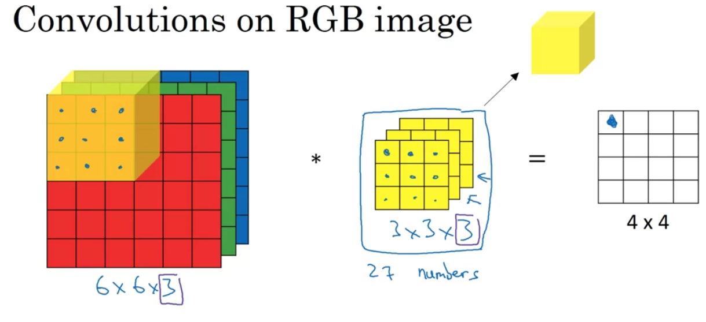
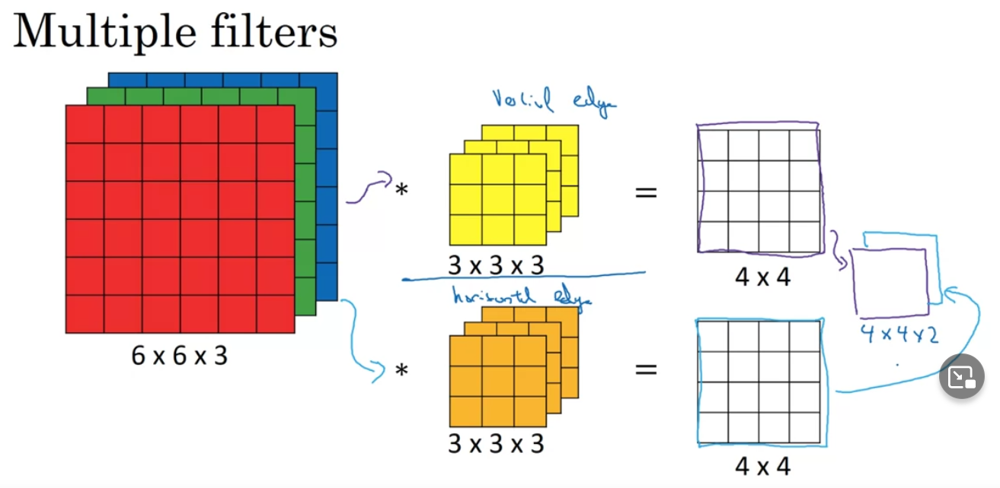
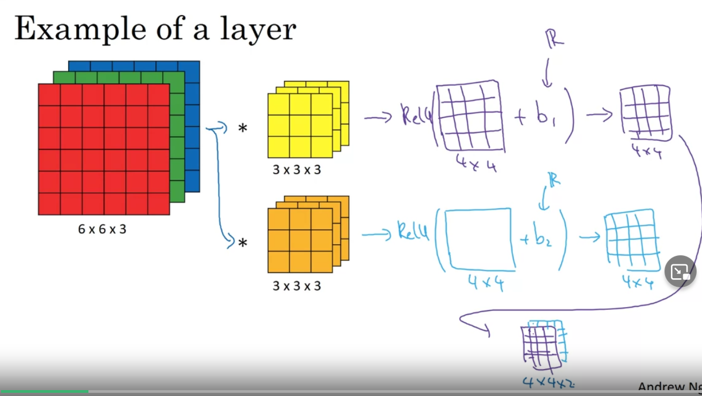
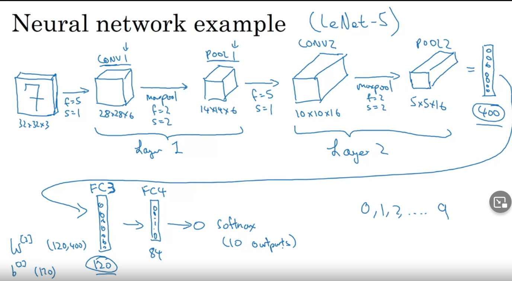

 ## CNN
- Convolutional Neural Networks
- convolution - math operation -> sum of products

## Notation for dim
- [l] = convolution layer number
- f[l] = filter size
- p[l] = padding
- s[l] = stride
- nc[l] = No. filters
- each filter is: f[l], f[l], nc[l-1]
- activations: a[l] -> nh[l], nw[l], nc[l] (same as layer output)
- weights: f[l], f[l], nc[l-1], nc[l] <- no. filters in layer l
- bias: nc[l]
- input: nh[l-1], nw[l-1], nc [l-1]
- output: nh[l], nw[l], nc[l]

## Convolution
- Operation on matrix (image) with kernel/filter
- kernel/filter - small matrix for detecting features (edges of images) usually 3x3, 5x5, 7x7
- in CNN kernel values are the parameters to learn e.g.

```
| w1 | w2 | w3 |
| w4 | w5 | w6 |
| w7 | w8 | w9 |
```

## Padding
- Adding "0" around input matrix
- Why:
    - every conv shrink the image
    - edge pixels are used less in output - less information from them

## Strided conv
- step for filer (normally 1)

## Sizes for convolution
- f is usually odd - to make padding integers and have central position
- for matrix n,n with filter f,f:
    - n-f+1, n-f+1
- with padding:
    - n+2p-f+1, n+2p-f+1
- with padding and stride:
    - (n+2p-f)/s+1, (n+2p-f)/s+1 -> round down to integer
- per layer:
    - (n[l-1]+2p[l]-f[l])/s[l]+1
- solve for padding
    - p = (f-1) / 2

## Convolution over volume
- use filter with same no. channels as imput matrix
- output has one channel
- this filters allow detecting features by channel



## Convolution over multiple filters
- Use to detect more features (e.g. v edges and h edges)
- produces more channels on output
- convolutions are done separately per filter



## One layer of conv
- To make in neural network layer we need to add non linerality and bias after convolution

- No. parameters in one layer for 10 filters 3,3,3:
    - 3 * 3 * 3 = 27 parameters + 1 bias = 28
    - 10 * 28 = 280 parameters
- No. parameters does not depend on input size.



## Types of layer in conv network
- convolution (CONV)
- Pooling (POOL)
- Fully connected (FC)

## Pooling layers
- filter layer for maximum/avg value (usually max)
- no parameters to learn
- must have same channels as input
- computation is done for each channel independently
- output have same no. of channels
- hyperparameters:
    - f -> no. filter size (2)
    - s -> stride (2)
- Why:
    - to reduce the dimensions of a layer

## Fully connected layers
- standard "deep" layers
- used to "prepare" network for output layer

## CNN example
- no. channels increase while dimensions decrease



## Why CNN
- Images have to many features to use in conventional "deep network" -> will overfit -> A lot of parameters
- in CNN no. parameters does not depend of the input size
- Parameter sharing:
    - A feature detector (e.g. edge) can be used in different parts of the image
- Sparsity of connections:
    - In each layer, each output value depends only on small number of inputs